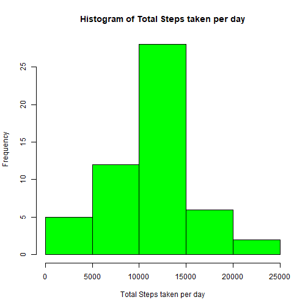
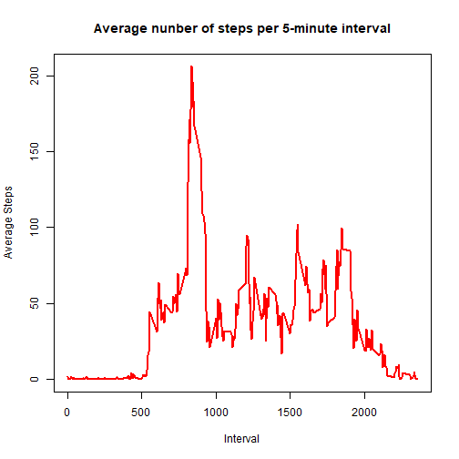
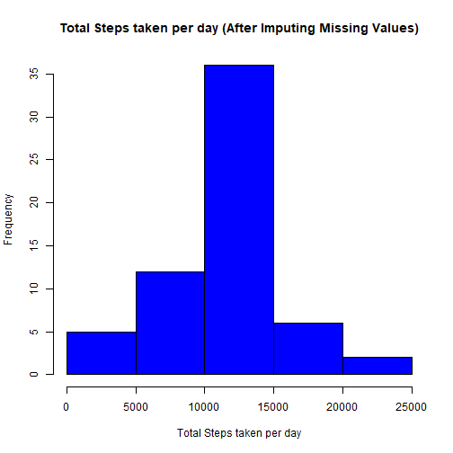
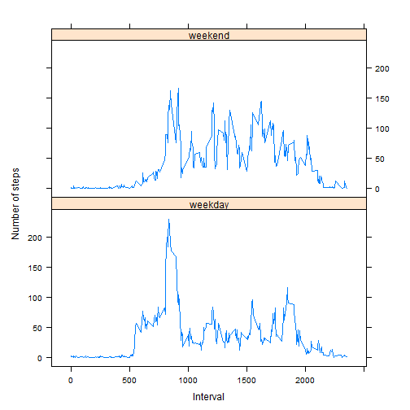

Note: HTML generated by using knit2html("PA1_template.Rmd", force_v1=TRUE) from command line as per the instructions. Loses the title and other such information in the output HTML file.

- Author: Sunil Garg
- Date: "03 September, 2017"

## Set global options

```r
knitr::opts_chunk$set(echo = TRUE)
```

## Loading and preprocessing the data
The following steps can be used to load and pre-process the data:

### Load the required libraries

```r
library(dplyr)
library(lattice)
```

### If the dataset csv file doesn't exist in the R Working Directory download the zip file and unzip it.

```r
if(!file.exists("activity.csv")) {
    ActivityDataFileURL <- "https://d396qusza40orc.cloudfront.net/repdata%2Fdata%2Factivity.zip"
    download.file(ActivityDataFileURL,"activity_data.zip", mode = "wb")
    unzip("activity_data.zip")
}
```

### Load the csv file into a dataframe

```r
activity_Df <- read.csv("activity.csv", na.strings = "NA")
#str(activity_Df)
```


## What is mean total number of steps taken per day?

### Calculate the total number of steps taken per day ignoring the NA Values

```r
StepsPerDay <- select(activity_Df, date, steps) %>% 
  na.omit() %>%
  group_by(date) %>%
  summarize(DailySteps=sum(steps, na.rm = TRUE)) %>%
  arrange(date)
```

### Histogram of the total number of steps taken each day

```r
hist(StepsPerDay$DailySteps, col="green", main="Histogram of Total Steps taken per day",
     xlab="Total Steps taken per day")
```



### Mean and median of the total number of steps taken per day

```r
meanStepsPerDay <- mean(StepsPerDay$DailySteps, na.rm = TRUE)
medianStepsPerDay <- median(StepsPerDay$DailySteps, na.rm = TRUE)
```
- The mean of the total number of steps taken per day is 1.0766189 &times; 10<sup>4</sup>.
- The median of the total number of steps taken per day is 10765.

## What is the average daily activity pattern?
### Calculate the average number of steps taken for each 5-minute interval ignoring the NA Values

```r
AverageStepsPerInterval <- select(activity_Df, interval, steps) %>% 
  na.omit() %>%
  group_by(interval) %>%
  summarize(AverageSteps=mean(steps, na.rm = TRUE)) %>%
  arrange(interval)
#str(AverageStepsPerInterval)
```
### Time series plot of the 5-minute interval (x-axis) and the average number of steps taken, averaged across all days (y-axis)  

```r
with(AverageStepsPerInterval, plot(interval,AverageSteps, type="l", lwd=2, col="red", 
                                   main="Average nunber of steps per 5-minute interval", 
                                   xlab = "Interval", ylab = "Average Steps"))
```



### Find the 5-minute interval, which contains the maximum number of steps on average across all the days in the dataset

```r
intervalWithMaxAverageSteps <- AverageStepsPerInterval[which.max(AverageStepsPerInterval$AverageSteps), "interval"]
```
- The 5-minute interval with maximum number of steps on average across all the days in the dataset is 835


## Imputing missing values
Note that there are a number of days/intervals where there are missing values (coded as NA). The presence of missing days may introduce bias into some calculations or summaries of the data.
### Calculate and report the total number of missing values in the dataset (i.e. the total number of rows with NAs)  

```r
missingValues <- sum(!complete.cases(activity_Df))
```
- The total number of rows with missing values (NAs) is 2304

### Devise a strategy for filling in all of the missing values in the dataset. The strategy does not need to be sophisticated. For example, you could use the mean/median for that day, or the mean for that 5-minute interval, etc.  
- We will use the mean steps for that 5-minute interval to replace the missing values for the steps. We have this stored in the dataframe AverageStepsPerInterval 

### Create a new dataset that is equal to the original dataset but with the missing data filled in.  

```r
Activity_df_NoNA <- merge(activity_Df, AverageStepsPerInterval, by.x="interval", by.y = "interval")
str(Activity_df_NoNA)
```

```
## 'data.frame':	17568 obs. of  4 variables:
##  $ interval    : int  0 0 0 0 0 0 0 0 0 0 ...
##  $ steps       : int  NA 0 0 0 0 0 0 0 0 0 ...
##  $ date        : Factor w/ 61 levels "2012-10-01","2012-10-02",..: 1 54 28 37 55 46 20 47 38 56 ...
##  $ AverageSteps: num  1.72 1.72 1.72 1.72 1.72 ...
```

```r
Activity_df_NoNA <- mutate(Activity_df_NoNA, steps = case_when(is.na(steps) ~ AverageSteps, 
                                                               !is.na(steps) ~ as.double(steps))) %>%
  select(steps, date, interval) %>%
  arrange(date, interval)
#str(Activity_df_NoNA)
```

### Histogram of the total number of steps taken each day after filling in the missing values  

```r
StepsPerDayNoNA <- select(Activity_df_NoNA, date, steps) %>% 
  group_by(date) %>%
  summarize(DailySteps=sum(steps, na.rm = TRUE)) %>%
  arrange(date)
hist(StepsPerDayNoNA$DailySteps, col="blue", main="Total Steps taken per day (After Imputing Missing Values)",
                                             xlab="Total Steps taken per day")
```



### Mean and median of the total number of steps taken per day after filling in the missing values  

```r
meanStepsPerDayNoNA <- mean(StepsPerDayNoNA$DailySteps, na.rm = TRUE)
medianStepsPerDayNoNA <- median(StepsPerDayNoNA$DailySteps, na.rm = TRUE)
```
- The mean of the total number of steps taken per day after filling in the missing values is 1.0766189 &times; 10<sup>4</sup>.
- The median of the total number of steps taken per day after filling in the missing values is 1.0766189 &times; 10<sup>4</sup>.

### Do these values differ from the estimates from the first part of the assignment?  
- The mean of the total number of steps taken per day after imputing missing data is same as before.
- The median of the total number of steps taken per day after imputing missing data is different than before.

### What is the impact of imputing missing data on the estimates of the total daily number of steps?  
- The mean of the total number of steps taken per day after filling in the missing values is same as before whereas the median has increased slightly.
- The peak of the histogram has gone up i.e. the number of days with steps between 10000 and 15000 has gone up significantly after imputing missing data.


## Are there differences in activity patterns between weekdays and weekends?
Use the dataset with the filled-in missing values for this part.

### Create a new factor variable daytype in the dataset with two levels - "weekday" and "weekend" indicating whether a given date is a weekday or weekend day.  

```r
Activity_df_NoNA <- mutate(Activity_df_NoNA, daytype = 
                    as.factor(case_when(weekdays(as.Date(date)) %in% c("Saturday", "Sunday" ) ~ "weekend", 
                                              TRUE ~ "weekday")))
#str(Activity_df_NoNA)
```


### Calculate the average number of steps taken for each 5-minute interval grouped by the factor variable daytype.

```r
AverageStepsPerIntervalBydaytype <- select(Activity_df_NoNA, daytype, interval, steps) %>% 
  group_by(daytype, interval) %>%
  summarize(AverageSteps=mean(steps, na.rm = TRUE)) %>%
  arrange(daytype,interval)
#str(AverageStepsPerIntervalBydaytype)
```

### Make a panel plot containing a time series plot (i.e. type = "l") of the 5-minute interval (x-axis) and the average number of steps taken, averaged across all weekday days or weekend days (y-axis)

```r
xyplot(AverageSteps ~ interval | factor(daytype), data = AverageStepsPerIntervalBydaytype, aspect = 1/2,
       type = "l", xlab="Interval", ylab = "Number of steps")   
```



